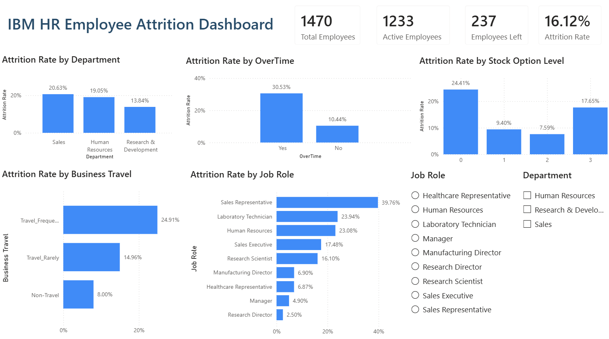

# IBM HR Employee Attrition Analysis

## Project Overview

Employee attrition is an important challenge for organizations because high employee turnover can increase recruitment costs, reduce productivity, and lead to the loss of experienced employees.

This project analyzes the **IBM HR Analytics Employee Attrition dataset** to identify the major factors associated with employees leaving the organization.

The project follows an end-to-end data analytics workflow using:

- **Python / Jupyter Notebook** for data cleaning and exploratory data analysis
- **MySQL** for business-focused SQL analysis
- **Power BI** for interactive dashboard development

The main focus of the project is to convert employee data into meaningful insights that can support better HR retention decisions.

---

## Project Objective

The objective of this project is to:

- Understand the overall employee attrition pattern
- Identify departments and job roles with higher attrition
- Analyze factors such as overtime, income, job satisfaction, business travel, tenure, and stock options
- Use SQL to answer important HR business questions
- Build an interactive Power BI dashboard for decision-making
- Provide actionable business insights based on the analysis

---

## Dataset

**Dataset:** IBM HR Analytics Employee Attrition & Performance

The dataset contains **1,470 employee records** with information related to:

- Employee demographics
- Department and job roles
- Monthly income
- Business travel
- Overtime
- Job satisfaction
- Work-life balance
- Environment satisfaction
- Job involvement
- Stock option level
- Years at company
- Total working experience
- Distance from home
- Employee attrition

### Target Variable

`Attrition`

- `Yes` → Employee left the organization
- `No` → Employee remained with the organization

---

## Tools & Technologies

### Python / Jupyter Notebook

Used for:

- Data understanding
- Data cleaning
- Exploratory Data Analysis
- Statistical summaries
- Data visualization
- Correlation analysis

### Python Libraries

- Pandas
- NumPy
- Matplotlib
- Seaborn

### MySQL

Used to perform business-focused SQL analysis using:

- `SELECT`
- `WHERE`
- `GROUP BY`
- `ORDER BY`
- `COUNT()`
- `SUM()`
- `AVG()`
- `CASE WHEN`
- `HAVING`
- `ROUND()`

### Power BI

Used to create an interactive HR attrition dashboard containing:

- KPI Cards
- Department analysis
- Job role analysis
- Overtime analysis
- Business travel analysis
- Stock option analysis
- Interactive slicers

---

## Project Workflow

Dataset  
↓  
Data Understanding  
↓  
Data Cleaning  
↓  
Exploratory Data Analysis  
↓  
Business Insights  
↓  
SQL Business Analysis  
↓  
Power BI Dashboard  
↓  
Final HR Recommendations

---

## Exploratory Data Analysis

The EDA was designed around meaningful business questions rather than creating visualizations for every available column.

Some of the major areas analyzed include:

- Overall Employee Attrition
- Department
- Age
- Monthly Income
- Job Role
- Overtime
- Marital Status
- Business Travel
- Job Satisfaction
- Work-Life Balance
- Environment Satisfaction
- Job Involvement
- Years at Company
- Total Working Years
- Stock Option Level
- Distance From Home
- Correlation between numerical features

Only analyses that contributed useful business insights were retained in the final project.

---

## Key Findings

### Overall Attrition

The organization has an overall attrition rate of **16.12%**.

- Total Employees: **1,470**
- Employees Left: **237**
- Active Employees: **1,233**

### Department

**Sales** recorded the highest departmental attrition rate at **20.63%**, followed by Human Resources at **19.05%**.

### Job Role

**Sales Representatives** recorded the highest job-role attrition rate at **39.76%**.

Other high-risk roles included:

- Laboratory Technician — **23.94%**
- Human Resources — **23.08%**

### Overtime

Employees working overtime had a significantly higher attrition rate:

- Overtime = Yes → **30.53%**
- Overtime = No → **10.44%**

This was one of the strongest attrition patterns identified in the project.

### Monthly Income

Average monthly income:

- Employees who left → **4,787.09**
- Employees who stayed → **6,832.74**

Employees who left generally earned less than employees who remained with the organization.

### Years at Company

Average tenure:

- Employees who left → **5.13 years**
- Employees who stayed → **7.37 years**

Employees leaving the organization generally had shorter tenure.

### Business Travel

Employees who travelled frequently had the highest attrition rate:

- Travel Frequently → **24.91%**
- Travel Rarely → **14.96%**
- Non-Travel → **8.00%**

### Stock Option Level

Employees with **Stock Option Level 0** recorded the highest attrition rate at **24.41%**.

Employees receiving stock options generally showed lower attrition.

### Distance From Home

Employees living farther from the workplace generally showed higher attrition compared with employees living closer.

The highest attrition was observed among employees living **21+ km** away at **22.06%**.

---

## SQL Analysis

MySQL was used to answer selected business questions without unnecessarily repeating the entire Python EDA.

The SQL analysis included:

1. Overall employee attrition rate
2. Department-wise attrition
3. Job-role-wise attrition
4. Overtime vs attrition
5. Average monthly income by attrition
6. Average years at company by attrition
7. Business travel vs attrition
8. Job roles contributing the highest number of employee exits
9. Job roles with attrition rates above 20%
10. Stock option level vs attrition

The complete SQL queries are available in:

`sql/hr_attrition_analysis.sql`

---

## Power BI Dashboard

An interactive Power BI dashboard was developed to provide a clear summary of employee attrition.

### KPI Cards

- Total Employees
- Active Employees
- Employees Left
- Attrition Rate

### Dashboard Visuals

- Attrition Rate by Department
- Attrition Rate by Overtime
- Attrition Rate by Job Role
- Attrition Rate by Business Travel
- Attrition Rate by Stock Option Level

### Interactive Filters

- Department
- Job Role

---

## Dashboard Preview

---

## Business Recommendations

Based on the analysis, the organization can consider the following actions:

- Review workload and overtime policies, particularly for employees regularly working overtime.
- Strengthen retention programs for high-attrition roles such as Sales Representatives and Laboratory Technicians.
- Review compensation structures for lower-paid employees.
- Improve onboarding, mentoring, and career-development opportunities for employees in the earlier stages of their careers.
- Evaluate flexible work arrangements or transportation support for employees with longer commuting distances.
- Review the use of long-term financial incentives such as stock options.
- Monitor employees who travel frequently and provide better work-life balance support.

---

## Repository Structure

    IBM-HR-Employee-Attrition-Analysis/
    │
    ├── data/
    │   └── ibm_hr_final.csv
    │
    ├── notebooks/
    │   └── IBM_HR_Attrition_EDA.ipynb
    │
    ├── sql/
    │   └── hr_attrition_analysis.sql
    │
    ├── powerbi/
    │   └── HR_Attrition_Dashboard.pbix
    │
    ├── images/
    │   └── dashboard_preview.png
    │
    └── README.md

---

## Conclusion

This project demonstrates an end-to-end data analytics workflow using **Python, MySQL, and Power BI**.

The analysis identified several important factors associated with employee attrition, particularly **overtime, job role, compensation, business travel, employee tenure, commuting distance, and stock options**.

By combining exploratory analysis, SQL-based business queries, and an interactive dashboard, the project provides a clear view of employee attrition patterns and highlights areas where HR teams can focus their retention strategies.
